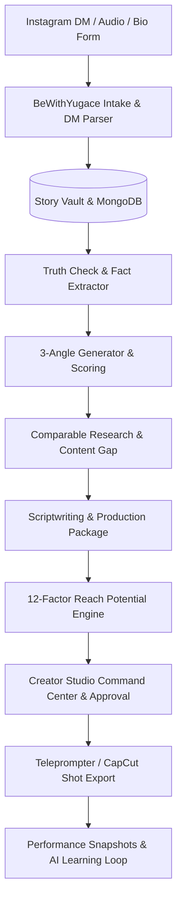

# 🎬 BeWithYugace — Untold Story to Reel Studio
> **An AI-powered creator studio engineered for turning raw Instagram DM follower stories into researched, truth-verified, 30–40 second viral Reels and Shorts.**

---

## 🌟 Key Features

- 📩 **Instagram DM-First Intake Engine**: Paste raw Instagram DM chat logs or voice transcripts directly into the studio. Automatically sanitizes and masks PII (phone numbers, emails, physical locations) in real time.
- 🛡️ **Zero-Hallucination Truth-Check**: Every extracted fact is strictly bound to verbatim quotes from the follower's message.
- 📐 **3-Angle Narrative Matrix**: Generates 3 scored angles (*High-Tension/Mystery, Emotional Vulnerability, Quiet Victory*) with creator overrides.
- 📊 **Benchmark & Content Gap Analysis**: Scrapes comparable short-form videos and highlights the unique **BeWithYugace Differentiator**.
- ✍️ **Viral Scriptwriter & 5 Hook Variations**: Produces tight 90–110 word (30–40s) scripts with 5 hook archetypes and on-screen caption/hashtag suites.
- 🎬 **Shot-by-Shot Timeline Table**: Timecode-synchronized camera angles, B-roll visuals, dynamic text, and audio SFX cues with **CapCut / Premiere CSV export**.
- 🎯 **Deterministic 12-Factor Reach Meter**: 0–100 reach index with retention drop-off risk predictions and mitigation tips.
- 📺 **Fullscreen Teleprompter Mode**: Built-in prompter with auto-scroll speed controls (1x–5x), font sizing, and mirrored glass support.
- 📈 **Continuous AI Learning Loop**: Track performance snapshots at **1h, 6h, 24h, and 48h** with AI post-mortem recalibration.
- 🎨 **Multi-Theme Super-App Engine**: Switch between *Obsidian Gold*, *Midnight Cyber*, *Studio Dark*, and *Electric Sunset*.

---

## 🚀 Quick Start

### 1. Installation
```bash
git clone https://github.com/sriyugesh03-ai/Untold-Story-to-Reel-Studio.git
cd Untold-Story-to-Reel-Studio
npm install
```

### 2. Run Development Server
```bash
npm run dev
```
Open [http://localhost:5173](http://localhost:5173) in your browser.

### 3. Build for Production
```bash
npm run build
```

---

## 📋 System Architecture



---

## 📄 License
MIT © 2026 **BeWithYugace Studio**
